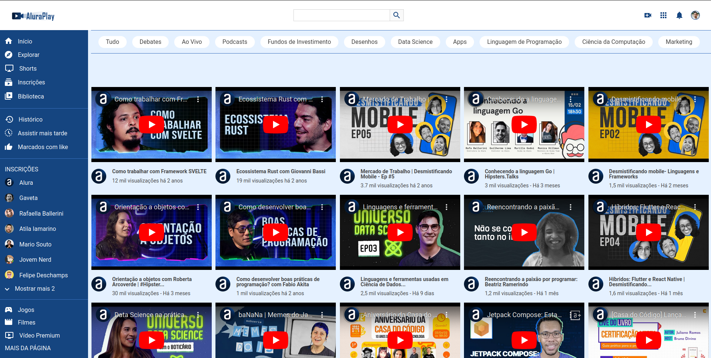
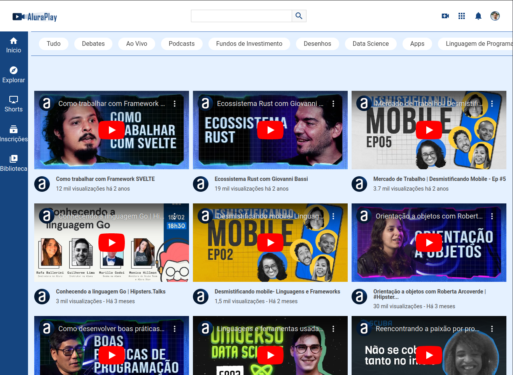

# Alura Play

Este projeto foi do curso de formação Front-end da Alura com parceria com a Oracle Next One total, com o objetivo principal de dominar a arte de criar telas responsivas para desktop, tablet e mobile, utilizando o FlexBox. Ao focar exclusivamente nessa linguagem de estilização, pude explorar profundamente as técnicas necessárias para tornar os layouts flexíveis e adaptáveis a diferentes dispositivos.

## :dizzy: Tecnologias utilizadas

<div>
  
  
  
</div>


## :computer: Visão Geral do Projeto

### Interface para Desktop


### Interface para Tablets


### Interface para Mobile


## :mag: Demonstração

Para uma experiência completa do funcionamento do projeto, você pode acessar a demonstração interativa do Portfolio Github Page: [clique aqui.](https://charlesbrcosta.github.io/Alura-Play/)

## :warning: Pré-requisitos

- Navegador web moderno que suporte HTML5, CSS3 e JavaScript.

## :open_file_folder: Como baixar o projeto para o computador

1. Clone o repositório:

   ```bash
   git clone https://github.com/charlesbrcosta/Alura-Play.git
   cd Alura-Play

2. Abra o arquivo index.html no seu navegador.

## :paperclip: Contribuição

1. Faça um fork do projeto.
2. Crie uma branch para a sua contribuição (git checkout -b feature/nova-funcionalidade).
3. Faça as alterações necessárias e commit (git commit -am 'Adicionando nova funcionalidade').
4. Push para a branch (git push origin feature/nova-funcionalidade).
5. Crie um novo Pull Request.

## :student: Autor

[<br><sub>Charles Bruno</sub>](https://github.com/charlesbrcosta)
